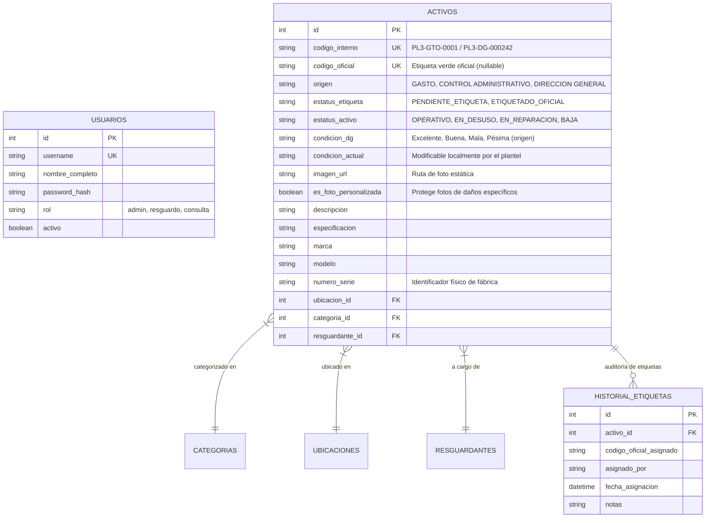

# Sistema de Bienes Muebles y Control de Activos — COBACH Plantel 3

Plataforma web integral de gestión, trazabilidad y control de inventario de bienes muebles patrimoniales para el **Colegio de Bachilleres del Estado de Chihuahua (Plantel 3)**.

Desarrollada para resolver la brecha operativa entre la catalogación externa de la Dirección General de Bienes Patrimoniales (Oficina Central) y las adquisiciones locales del plantel.

> 🌐 **Despliegue Activo en Producción:**  
> **[https://optimistic-surprise-production-137a.up.railway.app](https://optimistic-surprise-production-137a.up.railway.app)**

---

## 🎯 Contexto del Problema y Solución

### El Reto
En la operación cotidiana del Plantel 3:
1. **Dependencia de Dirección General:** El inventario oficial lo administra externamente la Dirección General de Bienes Patrimoniales mediante una plataforma legada poco accesible.
2. **El Limbo de la "Etiqueta Verde":** Cuando el plantel adquiere bienes con recursos propios (por vías de **Gasto** o **Control Administrativo**), transcurren meses antes de que el personal central acuda físicamente a pegar la etiqueta verde con el "Código" oficial. Durante este lapso, el plantel carecía de un sistema para registrar, auditar y asignar resguardos de dichos equipos.
3. **Silos de Información en Excel:** La información se encontraba dispersa en 4 archivos de hojas de cálculo desconectadas entre sí (1,406 activos en total).

### La Solución Técnica
* **Modelo Relacional Unificado:** Consolidación de los archivos Excel dispersos en una base de datos relacional (SQLite / PostgreSQL) con catálogos normalizados en 3FN (Ubicaciones, Categorías, Resguardantes).
* **Control de Accesos Basado en Roles (RBAC) y JWT:**
  * **`admin`**: Control administrativo y patrimonial total.
  * **`resguardo`**: Personal del plantel (resguardantes de aulas, oficinas y laboratorios); pueden dar de alta activos, actualizar condición física, marcar bienes en desuso o reparación y adjuntar fotografías.
  * **`consulta`**: Modo de solo lectura para auditorías y búsqueda general.
* **Cuentas Institucionales Compartidas:** Inicialización automática con contraseñas seguras PBKDF2-HMAC-SHA256 y botones de inicio rápido en 1 clic.
* **Ciclo de Vida de Doble Identificador:**
  * `codigo_interno`: Identificador único y atómico asignado de inmediato al ingresar el activo al plantel (`PL3-GTO-XXXX`, `PL3-CA-XXXX`, `PL3-DG-XXXXXX`). Consecutivo automático protegido contra alteración manual.
  * `codigo_oficial`: Número de la etiqueta verde oficial, el cual permanece pendiente (`NULL`) hasta su colocación física.
* **Módulo de Conciliación de Etiquetas:** Permite al encargado de informática buscar cualquier activo provisional y registrar en segundos el código oficial de la etiqueta verde tan pronto como Dirección General la instala, manteniendo una bitácora histórica inmutable de auditoría (`historial_etiquetas`).
* **Control y Filtro de Condición Física:** Escala oficial (`Excelente 81% - 100%`, `Buena 61% - 80%`, `Mala 41% - 60%`, `Pésima 0% - 40%`) con selector directo en la barra de búsqueda y comparativa de deterioro para justificar trámites de desincorporación/baja.
* **Registro Fotográfico de Activos:** Fotografías de alta resolución accesibles directamente desde la vista inicial, con protección inteligente contra sobreescritura de equipos con daños particulares al propagar fotos por modelo.
* **Impresión de Etiquetas en Hoja Carta (10 por Hoja / 2x5):**
  * Generación al vuelo en el cliente de **Código de Barras (CODE128)**, **Código QR** o **Ambos Códigos emparejados** con el logo institucional del Halcón Plantel 3.
  * Selector dinámico de codificación: **Código Interno (PL3-...)** o **Código (Verde)**.
  * Líneas de corte continuas, punteadas o sin líneas (para hojas autoadhesivas troqueladas estándar tipo **Avery 5163 / 5263**).
  * Esquinas cuadradas de 90° optimizadas para corte manual con guillotina o tijeras.
  * Función *"Llenar hoja (10)"* para generar plantillas completas de un activo en un solo clic.
* **Cola de Impresión Acumulativa (Print Queue):** Permite acumular activos de distintas áreas y mandarlos a impresión conjunta o exportar la selección.
* **Exportación Dinámica a Excel (.xlsx):** Selector interactivo de columnas (hasta 18 campos disponibles con controles "Todas", "Predeterminadas" y "Ninguna"), respetando filtros activos de condición física o selección de cola.

---

## 🗄️ Modelo de Datos Relacional



---

## 🚀 Instalación y Puesta en Marcha

### En Linux (Arch Linux, Ubuntu, Debian, etc.)

```bash
# 1. Clonar el repositorio
git clone git@github.com:bueno-armando/cobach3-bitacora.git
cd cobach3-bitacora

# 2. Iniciar con el script automatizado (crea .venv, instala dependencias y levanta el servidor)
./run.sh
```

O manualmente:
```bash
python -m venv .venv
source .venv/bin/activate
pip install -r requirements.txt
uvicorn backend.main:app --host 0.0.0.0 --port 8000 --reload
```

El sistema estará disponible en:
* Interfaz Web: **`http://localhost:8000`**
* Documentación Swagger API: **`http://localhost:8000/docs`**

### En Windows (Scripts Automatizados)

El repositorio incluye automatizaciones completas para entornos Windows:

1. **Instalación Inicial:**  
   Haz doble clic en **`instalar_windows.bat`**. Creará el entorno virtual `.venv`, instalará los paquetes y preparará la base de datos automáticamente.
2. **Uso Diario:**  
   Haz doble clic en **`iniciar_sistema.bat`** o **`iniciar.bat`**. Levantará el servidor escuchando en la red local (`0.0.0.0:8000`) y **abrirá automáticamente el navegador web predeterminado**.

*(Para una guía detallada sobre cómo abrir puertos en el Firewall de Windows, acceder desde otras computadoras de la red del plantel o configurar el inicio automático como servicio, consulta el manual interno `MANUAL_WINDOWS.md`).*

---

## 🔒 Privacidad de Datos y Demostración

Por razones de confidencialidad institucional y cumplimiento normativo de protección de datos personales, los archivos Excel con datos reales y la base de datos de producción están excluidos de este repositorio mediante `.gitignore`.

Para probar el sistema con datos de demostración realistas (computadoras, proyectores, pizarrones y mobiliario ficticio):

```bash
python scripts/seed_sample_data.py
```
Esto generará una base de datos `inventario.db` lista para interactuar con la plataforma.

---

## 👥 Cuentas Institucionales Predeterminadas

El sistema se inicializa automáticamente con 3 perfiles compartidos para facilitar la operación:

| Rol | Usuario | Contraseña | Perfil y Permisos |
| :--- | :--- | :--- | :--- |
| **`admin`** | `admin` | `Cobach3#Admin` | **Administrador:** Control total (altas, ediciones, eliminación permanente, asignación de etiqueta verde oficial, gestión de fotos y reportes). |
| **`resguardo`** | `resguardo` | `Cobach3#Resguardo` | **Personal:** Registro de nuevos activos (código autogenerado), reporte de desuso/reparación, actualización de condición física y fotos de evidencia. |
| **`consulta`** | `consulta` | `Cobach3#Consulta` | **Solo Lectura:** Búsqueda, visualización de fichas técnicas, exportación personalizada y cola de impresión. |

---

## 📋 Endpoints Principales de la API

| Método | Endpoint | Roles Permitidos | Descripción |
| :--- | :--- | :--- | :--- |
| `POST` | `/api/auth/login` | Público | Autenticación mediante credenciales y generación de token JWT Bearer (7 días) |
| `GET` | `/api/auth/me` | Todos | Obtener información y rol del usuario autenticado |
| `GET` | `/api/activos` | Todos | Consulta paginada con filtros (`q`, `origen`, `ubicacion_id`, `categoria_id`, `condicion`, `estatus_activo`) |
| `POST` | `/api/activos` | `admin`, `resguardo` | Registrar un nuevo activo (autogenera consecutivo `PL3-...` protegido) |
| `GET` | `/api/activos/{id}` | Todos | Ficha técnica y administrativa completa del activo con historial y foto |
| `PUT` | `/api/activos/{id}` | `admin` | Modificar datos técnicos o administrativos del activo |
| `DELETE` | `/api/activos/{id}` | `admin` | Eliminar definitivamente un activo del sistema |
| `PATCH` | `/api/activos/{id}/condicion` | `admin`, `resguardo` | Actualizar condición física (`Excelente`, `Buena`, `Mala`, `Pésima`), estatus y justificación técnica |
| `PATCH` | `/api/activos/{id}/estatus-operativo` | `admin`, `resguardo` | Cambio rápido de estado operativo (`ACTIVO`, `EN_DESUSO`, `EN_REPARACION`, `BAJA`) |
| `POST` | `/api/activos/{id}/imagen` | `admin`, `resguardo` | Subir fotografía con opción de propagación a modelo y protección de fotos particulares |
| `DELETE` | `/api/activos/{id}/imagen` | `admin` | Quitar fotografía de un activo |
| `POST` | `/api/activos/{id}/asignar-etiqueta` | `admin` | Conciliación y asignación de código oficial de etiqueta verde patrimonial |
| `GET` | `/api/export/excel` | Todos | Exportación dinámica en streaming a `.xlsx` con selector de columnas y filtros de condición |
| `GET` | `/api/catalogos` | Todos | Listado de ubicaciones, categorías y resguardantes normalizados |
| `GET` | `/api/stats` | Todos | Indicadores clave (total activos, oficiales vs. pendientes por origen y estado) |

---

## 📖 Documentación de Contexto Técnico
Para detalles técnicos exhaustivos sobre reglas de negocio, decisiones arquitectónicas y guías de desarrollo, consulta el archivo [**`CONTEXT.md`**](file:///home/senorbuen0/ISC/sem9/cobach3-bitacora/CONTEXT.md).

---

## 👤 Autor
Desarrollado como solución tecnológica para el **Colegio de Bachilleres del Estado de Chihuahua — Plantel 3**.
