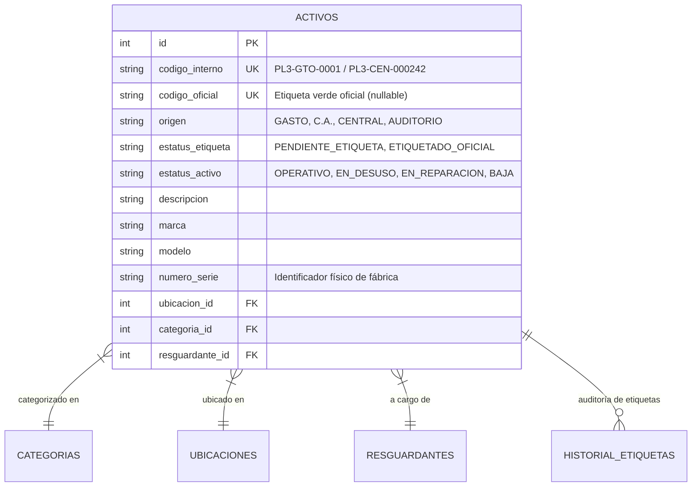

# Sistema de Inventario y Control de Activos — COBACH Plantel 3

Plataforma web integral de gestión, trazabilidad y control de inventario de bienes patrimoniales para el **Colegio de Bachilleres del Estado de Chihuahua (Plantel 3)**.

Desarrollada para resolver la brecha operativa entre la catalogación externa de la Dirección General de Bienes Patrimoniales (Oficina Central) y las adquisiciones locales del plantel.

---

## 🎯 Contexto del Problema y Solución

### El Reto
En la operación cotidiana del Plantel 3:
1. **Dependencia de Oficina Central:** El inventario oficial lo administra externamente la Dirección General mediante una plataforma legada poco accesible.
2. **El Limbo de la "Etiqueta Verde":** Cuando el plantel adquiere bienes con recursos propios (por vías de **GASTO** o **C.A.**), transcurren meses antes de que el personal central acuda físicamente a pegar la etiqueta verde con el "Código" oficial. Durante este lapso, el plantel carecía de un sistema para registrar, auditar y asignar resguardos de dichos equipos.
3. **Silos de Información en Excel:** La información se encontraba dispersa en 4 archivos de hojas de cálculo desconectadas entre sí.

### La Solución Técnica
* **Modelo Relacional Unificado:** Consolidación de los archivos Excel dispersos en una base de datos relacional (SQLite / PostgreSQL) con catálogos normalizados de ubicaciones, categorías y resguardantes.
* **Ciclo de Vida de Doble Identificador:**
  * `codigo_interno`: Identificador único y atómico asignado de inmediato al ingresar el activo al plantel (`PL3-GTO-XXXX`, `PL3-CA-XXXX`, `PL3-CEN-XXXXXX`, `PL3-AUD-XXXXXX`).
  * `codigo_oficial`: Número de la etiqueta verde oficial, el cual permanece pendiente (`NULL`) hasta su colocación física.
* **Módulo de Conciliación de Etiquetas:** Permite al encargado de informática buscar cualquier activo provisional y registrar en segundos el código oficial de la etiqueta verde tan pronto como la Oficina Central la instala, manteniendo historial de auditoría.
* **Control de Estado Físico / Operativo:** Registro y filtrado de bienes **Operativos**, **En Desuso (propuestos para baja/descarte)**, **En Reparación** o **Bajas Oficiales**.
* **Impresión de Etiquetas con Código QR:** Módulo integrado para generar e imprimir etiquetas adhesivas con el logo oficial del Halcón del Plantel 3, código QR y datos del activo.
* **Gestión CRUD Completa:** Registro, edición, baja lógica/física y consulta de cualquier bien en el sistema.

---

## 🛠️ Stack Tecnológico y Portabilidad

* **Backend:** Python 3.10+ / **FastAPI** (asíncrono, validación estricta con Pydantic, documentación Swagger interactiva).
* **ORM & Base de Datos:** **SQLAlchemy 2.0** con motor relacional **SQLite** (cero configuración, portabilidad total; compatible con PostgreSQL/MySQL mediante variable de entorno `DATABASE_URL`).
* **ETL & Data Processing:** **Pandas**, **OpenPyXL**, **LXML**.
* **Frontend:** HTML5, **Tailwind CSS**, FontAwesome, QRCode.js, Vanilla JS modular (sin dependencias complejas ni builds pesados).
* **Multiplataforma:** Diseñado para desarrollarse en **Linux (Arch Linux)** y ejecutarse sin fricción en servidores o PCs con **Windows**.

---

## 🗄️ Modelo de Datos Relacional



---

## 🚀 Instalación y Puesta en Marcha

### En Linux (Arch Linux, Ubuntu, Debian, etc.)

```bash
# 1. Clonar el repositorio
git clone git@github.com:bueno-armando/cobach3-bitacora.git
cd cobach3-bitacora

# 2. Iniciar con el script automatizado (crea venv, instala dependencias y levanta el servidor)
./run.sh
```

El sistema estará disponible en:
* Interfaz Web: **`http://localhost:8000`**
* Documentación Swagger API: **`http://localhost:8000/docs`**

### En Windows (Doble clic)

Simplemente ejecuta con doble clic el archivo:
```cmd
iniciar.bat
```
El script detectará Python, creará el entorno virtual, instalará dependencias, preparará la base de datos y abrirá automáticamente tu navegador web predeterminado.

---

## 🔒 Privacidad de Datos y Demostración (CV / Portafolio)

Por razones de confidencialidad institucional y cumplimiento normativo de protección de datos personales, los archivos Excel con datos reales y la base de datos de producción están excluidos de este repositorio mediante `.gitignore`.

Para probar el sistema con datos de demostración realistas (laptops, proyectores, pizarrones y butacas ficticias):

```bash
python scripts/seed_sample_data.py
```
Esto generará una base de datos `inventario.db` lista para interactuar con la plataforma.

---

## 📋 Endpoints Principales de la API

| Método | Endpoint | Descripción |
| :--- | :--- | :--- |
| `GET` | `/api/activos` | Consulta paginada con filtros por texto, origen (`GASTO`, `C.A.`), ubicación, categoría y estado físico |
| `POST` | `/api/activos` | Crear un nuevo activo en el inventario (autogenera código interno) |
| `GET` | `/api/activos/{id}` | Ficha técnica y administrativa completa de un activo con historial |
| `PUT` | `/api/activos/{id}` | Modificar datos del activo |
| `DELETE` | `/api/activos/{id}` | Eliminar un activo del sistema |
| `PATCH` | `/api/activos/{id}/estatus-operativo` | Actualizar estado físico (`OPERATIVO`, `EN_DESUSO`, `EN_REPARACION`) |
| `POST` | `/api/activos/{id}/asignar-etiqueta` | Conciliación y asignación de etiqueta verde oficial con validación de unicidad |
| `GET` | `/api/catalogos` | Listado de ubicaciones, categorías y resguardantes normalizados |
| `GET` | `/api/stats` | Indicadores clave (total activos, oficiales vs. pendientes por origen y estado) |

---

## 📖 Documentación de Contexto Técnico
Para detalles técnicos exhaustivos sobre reglas de negocio, modelos de datos y contexto para otros modelos de IA o colaboradores, consulta el archivo [**`CONTEXT.md`**](file:///home/senorbuen0/ISC/sem9/cobach3-bitacora/CONTEXT.md).

---

## 👤 Autor
Desarrollado como solución tecnológica para el **Colegio de Bachilleres del Estado de Chihuahua — Plantel 3**.
